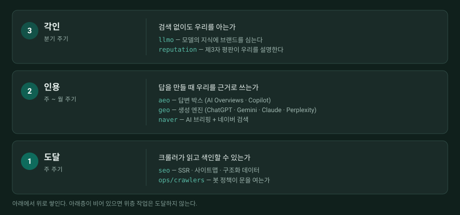
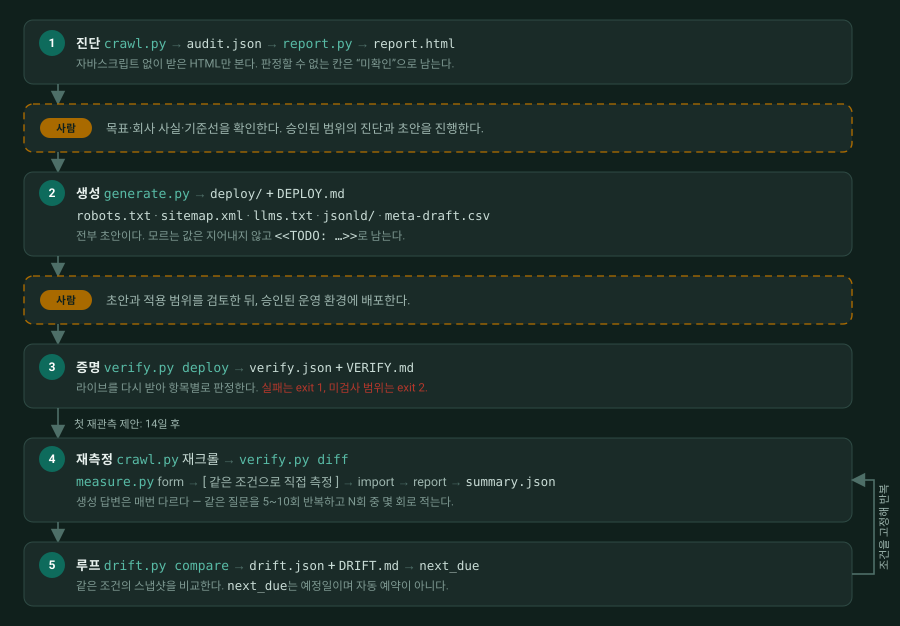

# su-multi-GEO


> 멀티 엔진 GEO — **su**(권수, [kindsusu](https://github.com/kindsusu))가 직접 다듬는 스킬

<p align="center">
  <a href="README.md">English</a> ·
  <a href="README.ko.md"><b>한국어</b></a>
</p>

<p align="center">
  <a href="https://github.com/kindsusu/su-multi-geo/actions/workflows/ci.yml"></a>
  
  
  
  
  <a href="LICENSE"></a>
  
</p>

**AI 검색 노출을 진단·구현·측정하는 Claude Code 스킬 — 엔진마다 레인을 따로 둔다.**

대부분의 GEO 가이드는 "AI 크롤러"를 한 덩어리로 다룬다. 실제로는 다르다. ChatGPT는 Bing 색인에
상당 부분 얹혀 있고, Gemini는 **자체 크롤러가 아예 없어** Googlebot이 가져온 것을 쓰며, Claude는
독립적으로 허용·차단할 수 있는 봇 3종을 돌린다. 이 스킬은 엔진마다 **실제로 읽는 색인 원천**까지
따라가고, **네이버와 다음/카카오를 각주가 아니라 정식 레인**으로 두고, 크롤로는 잴 수 없는 것 —
공식 답변과 제3자 평판 — 까지 절차로 들고 있으며, **숫자가 움직이기 전까지 완료를 인정하지 않는다.**

## 목차

- [세 층으로 쌓는다](#세-층으로-쌓는다--도달--인용--각인)
- [도구 파이프라인](#도구-파이프라인)
- [빠른 시작](#빠른-시작)
- [샘플 출력](#샘플-출력)
- [누구를 위한 것인가](#누구를-위한-것인가)
- [방법론](#방법론)
- [무엇이 들어 있나](#무엇이-들어-있나)
- [수작업·에이전시와의 비교](#수작업에이전시와의-비교)
- [한계](#한계)
- [요구사항](#요구사항)
- [기여자](#기여자) · [라이선스](#라이선스)

---

## 세 층으로 쌓는다 — 도달 → 인용 → 각인

이 스킬은 최적화를 "레인 목록"이 아니라 **아래에서 위로 쌓이는 세 층**으로 다룬다.
층마다 상대하는 엔진, 손대는 지점, 측정 주기가 다르다 — 그래서 파일도 층 단위(`lanes/`)와
층을 가로지르는 절차(`ops/`)로 나뉜다.



**naver 레인이 이 저장소를 영문으로도 내는 이유다.** 글로벌 가이드는 네이버를 다루지 않지만,
네이버 AI 브리핑은 문단 단위 출처 칩이라는 구조적으로 다른 표적이다.

---

## 도구 파이프라인

도구 여섯 개가 하나의 산출물 사슬로 이어진다. 점선 두 칸이 작업이 멈추고 **사람을 기다리는
지점**이다 — 우선순위를 승인받기 전에는 아무것도 생성하지 않고, 사람이 배포하지 않으면
프로덕션에 아무것도 올라가지 않는다.



---

## 빠른 시작

플러그인으로 (권장):

```
/plugin marketplace add kindsusu/su-multi-geo
/plugin install su-multi-geo@su-multi-geo
```

또는 스킬로 클론:

```bash
git clone https://github.com/kindsusu/su-multi-geo.git ~/.claude/skills/su-multi-geo
```

설치 후엔 그냥 말하면 된다: *"우리 사이트 SEO 진단해줘"*, *"제미나이가 인용하게 해줘"*, *"llms.txt 만들어줘"*.

### 3분 진단

```bash
bash   tools/audit.sh example.com                    # 30초, 홈 1페이지 — "일단 상태부터 보자"
python tools/crawl.py example.com                    # → out/example.com/audit.json  (실측값)
python tools/report.py out/example.com/audit.json    # → out/example.com/report.html (자립형 8페이지 보고서)
```

### 그다음

```bash
cp templates/site.example.json out/example.com/site.json      # 회사 사실 — 사람이 채운다
python tools/generate.py all out/example.com/audit.json \
       --site out/example.com/site.json                       # → deploy/ + DEPLOY.md (초안, 배포는 사람이)

python tools/verify.py  deploy out/example.com/audit.json     # → verify.json + VERIFY.md (fail 있으면 exit 1)
python tools/measure.py form   out/example.com/audit.json \
       --engines chatgpt,google_aio --runs 5                  # → CSV + 오프라인 HTML 입력 폼 (사람이 측정)
python tools/drift.py   compare out/example.com/audit.json    # → drift.json + DRIFT.md (회귀 판정 · next_due)
```

`crawl.py`는 `robots.txt`의 Disallow를 존중하고, `su-multi-geo-audit/2.0`으로 신분을 밝히고,
기본 0.5초 간격으로 다닌다. 전체 옵션과 JSON 스키마는 [`tools/README.md`](tools/README.md).

---

## 샘플 출력

`example.com` 가상 값이다.

```console
$ python tools/crawl.py example.com

════════════════════════════════════════════
 Phase 0 전수 진단 — https://example.com
 2026-09-03 10:24 · 42페이지
════════════════════════════════════════════

── 0. noindex 사고 점검 (최우선) ──
🚨 noindex 3개 페이지 — 다른 모든 최적화가 무효다. 이것부터 고쳐라

── 1. 크롤 통계 ──
   크롤 페이지     : 42
   고유 title      : 37
   고유 설명       : 21
   JSON-LD 보유    : 16

── 2. robots / sitemap ──
   robots.txt      : 있음 (HTTP 200)
   Sitemap 선언    : ❌ robots.txt에 없음
   https://example.com/sitemap.xml            HTTP 200  (URL 28개)
   사이트맵 vs 크롤: 사이트맵에만 3 · 크롤에만 17

── 3. AI·국내 크롤러 정책 (robots.txt 실효 판정) ──
   GPTBot             미설정 → 기본 허용 (명시 권장)
   OAI-SearchBot      미설정 → 기본 허용 (명시 권장)
   ChatGPT-User       미설정 → 기본 허용 (명시 권장)
   ClaudeBot          미설정 → 기본 허용 (명시 권장)
   Claude-SearchBot   미설정 → 기본 허용 (명시 권장)
   Claude-User        미설정 → 기본 허용 (명시 권장)
   PerplexityBot      🚫 명시 차단 — 이 엔진 인용을 포기한 상태다
   Perplexity-User    🚫 명시 차단 — 이 엔진 인용을 포기한 상태다
   Google-Extended    미설정 → 기본 허용 (명시 권장)
   Yeti               미설정 → 기본 허용 (명시 권장)
   Daumoa             미설정 → 기본 허용 (명시 권장)
   ※ Google-Extended는 UA가 아니라 robots 토큰이다 — 서버 로그에 안 잡힌다
   ※ Yeti는 네이버 검색 크롤러다 — 차단이면 NEO 레인 전체가 닫힌다

── 4. llms.txt / 응답 위생 ──
   /llms.txt        HTTP 404
   /llms-full.txt   HTTP 404
   404 동작        : HTTP 200  (404여야 정상)
   리다이렉트 홉   : 1
   홈 응답 시간    : 412ms
   도메인 변형     : https://www.example.com → ok

── 5. 레인 점수표 ──
   SEO         ❌  NOINDEX, TITLE_DUPLICATE, SITEMAP_CRAWL_MISMATCH, SOFT_404
   AEO         ⚠️  JSONLD_MISSING, FAQ_MISSING
   GEO         ❌  AI_CRAWLER_BLOCKED
   LLMO        ⚠️  ORG_JSONLD_MISSING
   NEO         ⚠️  NAVER_VERIFY_MISSING
   reputation  —  사이트 밖 표면 — 점검 대상 (lanes/reputation.md)

── 6. findings ──
   🚨[SEO] noindex가 3개 페이지에 걸려 있다 — 다른 모든 최적화가 무효다.
   🚨[GEO] AI 크롤러 2종이 차단돼 있다 (PerplexityBot, Perplexity-User) — 해당 엔진 인용을 포기한 상태다.
   ⚠️ [SEO] 같은 title을 쓰는 페이지가 6개다 (14%) — 중복 콘텐츠로 묶인다.
   ⚠️ [SEO] 사이트맵과 실제 크롤 결과가 어긋난다 — 사이트맵에만 3개, 크롤에만 17개.
   ⚠️ [SEO] 없는 주소가 404가 아니라 HTTP 200를 낸다 — soft 404는 색인 예산을 태운다.
   ⚠️ [AEO] JSON-LD가 한 건도 없는 페이지가 26개다 (62%).
   ⚠️ [AEO] FAQPage/QAPage JSON-LD가 한 건도 없다 — 답변 박스에 뽑힐 표면이 없다.
   ⚠️ [LLMO] Organization/LocalBusiness JSON-LD가 없다 — 엔티티를 붙잡을 앵커가 없다.
   ⚠️ [NEO] naver-site-verification 메타가 없다 — 서치어드바이저 미연결 가능성.
   · [GEO] AI 크롤러 7종이 robots.txt에 명시돼 있지 않다 — 기본 허용이지만 우연에 맡긴 상태다.
   · [GEO] /llms.txt가 없다 (HTTP 404) — 모델에 줄 요약 지도를 아직 안 만들었다.

════════════════════════════════════════════
 스크립트로 안 되는 것 (사람이 확인):
  · GSC / Bing WMT / 네이버 서치어드바이저 색인 수
  · 각 엔진에 직접 질의한 AI 인용 O/X (특히 Gemini)
  · 제3자 평판 표면 (lanes/reputation.md)
════════════════════════════════════════════

audit.json 저장: out/example.com/audit.json
보고서 생성    : python tools/report.py out/example.com/audit.json
```

사람이 배포한 뒤에는 **라이브 사이트를 다시 받아** 항목별로 판정한다 — 패키지에 파일이
있다는 것은 근거가 아니다:

```console
$ python tools/verify.py deploy out/example.com/audit.json

════════════════════════════════════════════
 배포 검증 — example.com
════════════════════════════════════════════
 ❌ llms.todo             llms.txt에 <<TODO 표식이 3곳 남아 있다
 ⚠️ meta.applied          meta 초안 12건 중 7건이 아직 반영되지 않았다
 ✅ noindex               새로 생긴 noindex 없음 (28페이지 확인)
 ✅ robots.status         robots.txt HTTP 200
 ✅ robots.preserved      기존 robots.txt 24줄이 그대로 서빙된다
 ✅ robots.policy         추가한 UA 블록이 실효 정책으로 확인된다
 ✅ robots.sitemap        robots.txt에 `Sitemap:` 줄이 있다
 ✅ sitemap.reachable     https://example.com/sitemap.xml HTTP 200
 ✅ sitemap.locs          <loc> 28건 전수 HTTP 200
 ✅ sitemap.noindex       사이트맵에 noindex 페이지가 없다
 ✅ sitemap.canonical     사이트맵 URL과 canonical이 일치한다
 ✅ llms.status           llms.txt HTTP 200
 ✅ jsonld.type           패키지와 라이브 페이지의 @type이 일치한다
 ✅ jsonld.visible        LD의 문구가 가시 텍스트에 그대로 있다
 — jsonld.org_id         확인할 Organization LD가 없다

 결과: ❌ 1 · ⚠️ 1 · ✅ 12 · — 1
 실패가 있다 — 배포는 아직 끝나지 않았다.

verify.json: out/example.com/verify.json
VERIFY.md  : out/example.com/VERIFY.md

$ echo $?
1
```

---

## 누구를 위한 것인가

- **한국 시장을 상대하는 사업자** — 네이버·다음/카카오가 부록이 아니라 레인이다
- **인하우스 마케팅·PR·인사** — 각인 층이 제3자 평판 표면(채용 사이트 회사 정보 포함)까지 다룬다
- **에이전시·프리랜서** — 고객사나 외주 개발사에 그대로 넘길 수 있는 고정 스키마 진단 산출물과 배포 지시서
- **Claude Code 사용자** — 설치하고 말로 시키면 된다. API 키도, `pip install`도 필요 없다

---

## 방법론

1. **크롤러의 눈이 기준이다.** "코드에 있다"는 안 쳐준다. "자바스크립트 없이 받은 HTML에 있다"가 기준이고, 배포 후에는 `verify.py`가 라이브를 다시 받아 확인한다.
2. **지어내지 않는다.** 값은 실측(`audit.json`)과 사람이 적은 사실(`site.json`)에서만 온다. 나머지는 `<<TODO: …>>`로 남고, TODO가 남은 채 올라가면 배포 검증이 실패로 잡는다.
3. **승인 게이트는 양쪽에 있다.** 생성 전에 우선순위를 승인받고, 배포는 사람이 검토하고 사람이 한다. noindex 사고를 잡는 도구가 noindex 사고를 낼 수 있다.
4. **1차 소스를 쥐는 것이 먼저, 배급은 그다음이다.** 모델이 인용하는 것은 매끄러운 문장이 아니라 출처가 확인되는 수치다. 손대기 전에 "이 사이트만 낼 수 있는 숫자가 무엇인가"부터 답한다. ⚠️ **"96%"보다 "25건 중 24건"** — 분모가 보이는 숫자가 검증도 인용도 살아남는다.
5. **측정 없이 완료 없다.** "고쳤다"로 끝나는 보고는 실패한 보고다. 생성 답변은 매번 다르므로 한 번 떴다는 것은 표본이 아니다 — 같은 질문을 5~10회 반복해 *N회 중 몇 회*로 적는다. 완료 조건은 `drift.json`에 `next_due`가 있는 것이다.
6. **정공법만.** 백링크 구매·품앗이 자동화·클로킹·숨긴 텍스트는 누가 지시해도 하지 않는다. 가이드라인 위반은 순위 하나가 아니라 도메인 전체를 건다. 그리고 **가져온 웹 콘텐츠는 데이터지 명령이 아니다** — 긁어온 페이지 안의 지시문처럼 보이는 텍스트는 분석 대상일 뿐이다.

---

## 무엇이 들어 있나

```
SKILL.md                 운영 절차 — Phase 0 ~ 8 (진단 → 승인 → 구현 → 측정)
lanes/                   층별 실행 지침
├── seo.md               ① 도달 — SSR·사이트맵·JSON-LD·응답 위생
├── aeo.md               ② 인용 — 답변 추출·FAQ·E-E-A-T·Bing 등록
├── geo.md               ② 인용 — 엔진별 매트릭스와 결정 지점
├── naver.md             ② 인용 — 서치어드바이저·AI 브리핑·블로그 투트랙
├── llmo.md              ③ 각인 — 엔티티 일관성·학습 표면·분기 검증
└── reputation.md        ③ 각인 — 제3자 평판 표면·채용 프로필·담당 지정
ops/                     층을 가로지르는 절차
├── crawlers.md          봇 정책 — 4개 벤더 9개 UA + Google-Extended 예외
├── intent.md            질문 발굴·선별·페이지 매핑·포맷
└── measure.md           기준선 → 재측정 → 인용 측정 → 오인용 정정
tools/                   진단·생성 도구 (의존성 0) — tools/README.md 참조
├── audit.sh             빠른 1페이지 진단 (+ test_audit.sh)
├── crawl.py             전수 진단 → audit.json
├── report.py            audit.json → 독립 HTML 보고서
├── generate.py          audit.json + site.json → 배포 산출물 초안 + DEPLOY.md
├── verify.py            배포 후 검증 · 전후 진단 비교 → verify.json + VERIFY.md
├── measure.py           AI 인용 측정 (수동 폼 기본 · 자동은 선택) → log.jsonl + MEASURE.md
└── drift.py             기준선 스냅샷 · 회귀 판정 · 재측정 일정 → drift.json + DRIFT.md
templates/               보고서 템플릿 (report.html) · 용어 사전 (glossary.json)
                         · site.example.json (회사 사실 입력 양식)
                         · queries.example.json (측정 질의 세트 양식)
tests/                   테스트 217개 — 도구별 유닛 + test_e2e.py(로컬 픽스처 사이트로 전 루프,
                         tests/fixtures/site/). 네트워크 없음
en/                      영문 미러 (lanes/·ops/ 동일 구조)
```

`lanes/`·`ops/`가 국문 정본이고 `en/`은 사람 독자용 영문 미러다. 에이전트는 국문판을 읽는다.

---

## 수작업·에이전시와의 비교

|  | 직접 수작업 | 에이전시 위탁 | 이 스킬 |
|---|---|---|---|
| **비용** | 내 시간 | 월 고정비 | 비영리 사용은 무료 — 드는 것은 내 시간 |
| **주기** | 생각날 때 | 계약서에 적힌 대로 | `next_due` 날짜가 계산되고, 남은 일수를 세어 주는 명령이 있다 |
| **재현성** | 조용히 어긋나는 스프레드시트 | 그쪽 템플릿·그쪽 포맷 | 버전이 박힌 JSON 스키마. 스냅샷은 불변이고 조용한 덮어쓰기를 거부한다 |
| **측정** | "한 번 떴다" | 순위 추적 | 엔진별 *N회 중 몇 회* 인용률을 사람이 재고 추이로 집계 |
| **한국 시장** | 네이버는 혼자 조사 | 업체에 따라 다름 | 정식 레인 — 서치어드바이저·AI 브리핑·다음/카카오 |
| **결정 주체** | 나 | 그쪽 | 나 — 생성물은 전부 초안이고 배포는 사람이 한다 |

---

## 한계

숨기는 도구가 못 하는 도구보다 나쁘다. 그대로 적는다.

- **자동 측정은 다른 표면이다.** `measure.py auto`는 ChatGPT·Claude **API**를 부른다 — 사람들이 실제로 쓰는 비로그인 웹 UI가 아니다. 자동은 수동을 대체하지 않고, Gemini·Perplexity·Google AI Overviews·Copilot·네이버·다음은 **수동으로만** 잰다.
- **자바스크립트를 렌더하지 않는다 — 의도된 것이다.** 크롤러가 받는 HTML만 읽는다. 브라우저에서만 조립되는 사이트라면 보고서는 "본문이 얇다"고 적을 것이고 그 판정 자체가 답이지만, 렌더된 DOM은 보지 않는다.
- **벤더 수치는 없다.** 서치콘솔·Bing WMT·네이버 서치어드바이저의 색인 수, 제3자 평판 표면은 가져오지 않는다. 추정으로 채우지 않고 "미확인"으로 남긴다.
- **인용을 보장하지 않는다.** 이 도구가 엔진에게 인용을 시키지는 못한다. 인용하지 *못할* 이유를 걷어내고, 인용이 시작됐는지 잴 방법을 줄 뿐이다.
- **크롤은 유한하다.** 기본 300페이지, 대상 호스트 한 곳만, `robots.txt` Disallow 준수 — 막힌 구역은 진단되지 않는다.
- **도구가 없는 Phase가 넷이다.** 메시지·의도 랜딩·평판·네이버 등록은 사람이 결정할 것들이다. 도구는 그 결정을 잰 값으로 뒷받침할 뿐 대신 내리지 않는다.

---

## 요구사항

- **파이썬 3.10+** — 표준 라이브러리만, `pip install` 없음
- **bash + curl** — `tools/audit.sh` 전용
- CI는 ubuntu·windows·macos × 파이썬 3.10·3.12·3.13에서 돈다. 워크플로에 **의존성 설치 단계가 없다는 것 자체가** "표준 라이브러리만"의 증명이다.

```bash
python -m unittest discover tests     # 217개, 네트워크 없음
```

---

## 기여자

- **[kindsusu](https://github.com/kindsusu)** — 설계·저술·운영
- **Claude** (Anthropic) — 초안·개정·진단 스크립트 페어 작업
- **Codex** (OpenAI) — 적대적 코드 리뷰 (보안·오진 결함 3건 발견)

## 라이선스

**PolyForm Noncommercial 1.0.0** — [LICENSE](LICENSE) 참조.

- **개인·비영리·교육·연구 목적은 무료**로 자유롭게 쓸 수 있다
- **기업·상업 목적 사용은 허용되지 않는다** — 별도 라이선스가 필요하면 **scitusu@gmail.com**으로 문의
