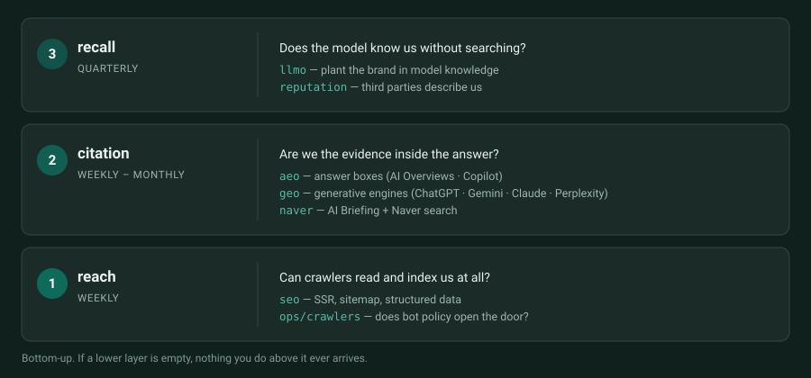
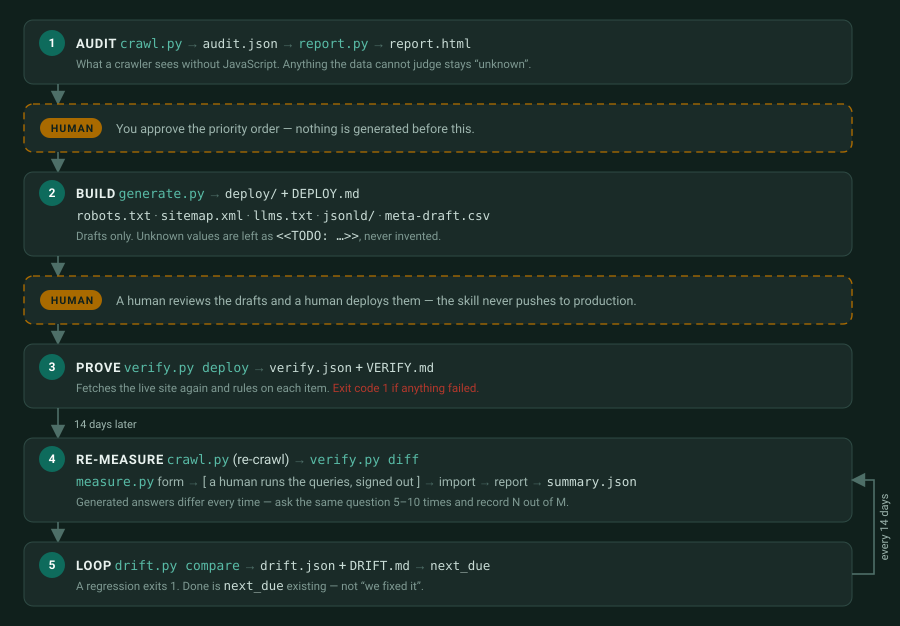

# su-multi-GEO


> multi-engine GEO, hand-tuned by **su** ([kindsusu](https://github.com/kindsusu))

<p align="center">
  <a href="README.md"><b>English</b></a> ·
  <a href="README.ko.md">한국어</a>
</p>

<p align="center">
  <a href="https://github.com/kindsusu/su-multi-geo/actions/workflows/ci.yml"></a>
  
  
  
  <a href="LICENSE"></a>
  
</p>

**A Claude Code skill that audits, implements, and measures AI search visibility — with a separate lane per engine.**

Most GEO guides treat "AI crawlers" as one bucket. They are not. Training crawlers, search
crawlers, user-triggered fetchers, and ordinary search indexes have different roles and controls.
This skill records those surfaces separately, keeps **Naver and Daum/Kakao as first-class lanes**,
and separates technical readiness from observed citation, traffic, and conversion results.

## Contents

- [Three layers](#three-layers--reach-citation-recall)
- [The tool pipeline](#the-tool-pipeline)
- [Quick start](#quick-start)
- [Sample output](#sample-output)
- [Who it's for](#who-its-for)
- [Method](#method)
- [What's inside](#whats-inside)
- [Compared to the alternatives](#compared-to-the-alternatives)
- [Limits](#limits)
- [Requirements](#requirements)
- [Contributors](#contributors) · [License](#license)

---

## Three layers — reach, citation, recall

Optimization here is not a list of lanes. It is **three layers stacked bottom-up**, each facing
different engines, different control points, and a different measurement cycle — which is why the
files split into per-layer lanes (`lanes/`) and cross-layer procedures (`ops/`).



**The naver lane is why this repo exists in English.** Global guides skip Naver entirely, but
Naver AI Briefing cites at the paragraph level with source chips — a structurally different target.

---

## The tool pipeline

The tools share one artifact chain. Read-only audits and local drafts can proceed within the task
scope; production deployment and external account changes remain explicit operational decisions.
Every generated file is a reviewable draft, and live verification checks what the server actually
returns.



---

## Quick start

Install as a plugin (recommended):

```
/plugin marketplace add kindsusu/su-multi-geo
/plugin install su-multi-geo@su-multi-geo
```

Or clone as a skill:

```bash
git clone https://github.com/kindsusu/su-multi-geo.git ~/.claude/skills/su-multi-geo
```

Then just ask: *"audit my site's SEO"*, *"get Gemini to cite us"*, *"create llms.txt"*.

### Three minutes to a diagnosis

```bash
python tools/seo_geo.py doctor
python tools/seo_geo.py audit https://example.com --out out
# → out/example.com/audit.json + report.html
```

### Then

```bash
cp templates/site.example.json out/example.com/site.json      # your company's facts, written by you
python tools/seo_geo.py generate all out/example.com/audit.json \
       --site out/example.com/site.json                       # → deploy/ + DEPLOY.md (drafts, for a human to ship)

python tools/seo_geo.py verify deploy out/example.com/audit.json
python tools/seo_geo.py measure form out/example.com/audit.json \
       --engines chatgpt,google_aio --runs 5                  # → CSV + an offline HTML form for a human to fill
python tools/seo_geo.py drift compare out/example.com/audit.json
python tools/seo_geo.py status out/example.com/audit.json
```

Deployment verification exits `0` only for a complete check with no failures, `1` for a verified
failure, and `2` when required scope remains unverified. Ordinary advisory warnings do not by
themselves change the exit code.

`audit` honors applicable `robots.txt` rules, uses a bounded crawl, records coverage and creates
the HTML report. An incomplete crawl never produces a replacement sitemap. Full command reference
and JSON schemas: [`tools/README.md`](tools/README.md).

---

## Sample output

Fictional values for `example.com`. The tools are Korean-first — so is the console.

```console
$ python tools/crawl.py example.com

════════════════════════════════════════════
 Phase 0 범위 제한 진단 — https://example.com
 2026-09-03 10:24 · 42페이지
════════════════════════════════════════════

── 0. noindex 사고 점검 (최우선) ──
🚨 noindex 3개 페이지 — 다른 모든 최적화가 무효다. 이것부터 고쳐라

── 1. 크롤 통계 ──
   크롤 페이지     : 42
   고유 title      : 37
   고유 설명       : 21
   JSON-LD 보유    : 16

── 2. robots / sitemap ──
   robots.txt      : 있음 (HTTP 200)
   Sitemap 선언    : ❌ robots.txt에 없음
   https://example.com/sitemap.xml            HTTP 200  (URL 28개)
   사이트맵 vs 크롤: 사이트맵에만 3 · 크롤에만 17

── 3. AI·국내 크롤러 정책 (robots.txt 실효 판정) ──
   GPTBot             미설정 → 기본 허용 (명시 권장)
   OAI-SearchBot      미설정 → 기본 허용 (명시 권장)
   ChatGPT-User       미설정 → 기본 허용 (명시 권장)
   ClaudeBot          미설정 → 기본 허용 (명시 권장)
   Claude-SearchBot   미설정 → 기본 허용 (명시 권장)
   Claude-User        미설정 → 기본 허용 (명시 권장)
   PerplexityBot      🚫 명시 차단 — 학습/수집 표면 제한
   Perplexity-User    🚫 명시 차단 — 사용자 요청 가져오기 표면 제한
   Google-Extended    미설정 → 기본 허용 (명시 권장)
   Yeti               미설정 → 기본 허용 (명시 권장)
   Daumoa             미설정 → 기본 허용 (명시 권장)
   ※ Google-Extended는 UA가 아니라 robots 토큰이다 — 서버 로그에 안 잡힌다
   ※ Yeti는 네이버 검색 크롤러다 — 차단이면 NEO 레인 전체가 닫힌다

── 4. llms.txt / 응답 위생 ──
   /llms.txt        HTTP 404
   /llms-full.txt   HTTP 404
   404 동작        : HTTP 200  (404여야 정상)
   리다이렉트 홉   : 1
   홈 응답 시간    : 412ms
   도메인 변형     : https://www.example.com → ok

── 5. 레인 점수표 ──
   SEO         ❌  NOINDEX, TITLE_DUPLICATE, SITEMAP_CRAWL_MISMATCH, SOFT_404
   AEO         ⚠️  SNIPPET_RESTRICTED
   GEO         ⚠️  일부 검색·사용자 가져오기 표면 제한
   LLMO        ⚠️  ORG_JSONLD_MISSING
   NEO         ⚠️  NAVER_VERIFY_MISSING
   reputation  —  사이트 밖 표면 — 점검 대상 (lanes/reputation.md)

── 6. findings ──
   🚨[SEO] noindex가 3개 페이지에 걸려 있다 — 다른 모든 최적화가 무효다.
   ⚠️ [GEO] 검색·사용자 가져오기 역할의 크롤러 접근이 제한돼 있다 — 해당 표면의 영향은 별도 확인한다.
   ⚠️ [SEO] 같은 title을 쓰는 페이지가 6개다 (14%) — 제목 중복이며 본문 중복 여부는 별도 확인한다.
   ⚠️ [SEO] 사이트맵과 실제 크롤 결과가 어긋난다 — 사이트맵에만 3개, 크롤에만 17개.
   ⚠️ [SEO] 없는 주소가 404가 아니라 HTTP 200를 낸다 — soft 404는 색인 예산을 태운다.
   · [AEO] 적합한 페이지에는 구조화 데이터를 추가할 수 있다 — FAQ/JSON-LD는 필수 조건이 아니다.
   ⚠️ [LLMO] Organization/LocalBusiness JSON-LD가 없다 — 엔티티를 붙잡을 앵커가 없다.
   ⚠️ [NEO] naver-site-verification 메타가 없다 — 서치어드바이저 미연결 가능성.
   · [GEO] AI 크롤러 7종이 robots.txt에 명시돼 있지 않다 — 기본 허용이지만 우연에 맡긴 상태다.
   · [GEO] /llms.txt가 없다 (HTTP 404) — 선택 기능이며 검색·인용의 필수 조건은 아니다.

════════════════════════════════════════════
 스크립트로 안 되는 것 (사람이 확인):
  · GSC / Bing WMT / 네이버 서치어드바이저 색인 수
  · 각 엔진에 직접 질의한 AI 인용 O/X (특히 Gemini)
  · 제3자 평판 표면 (lanes/reputation.md)
════════════════════════════════════════════

audit.json 저장: out/example.com/audit.json
보고서 생성    : python tools/report.py out/example.com/audit.json
```

After the human deploys, the same site is fetched again and each item is ruled on — a file
sitting in the package proves nothing:

```console
$ python tools/verify.py deploy out/example.com/audit.json

════════════════════════════════════════════
 배포 검증 — example.com
════════════════════════════════════════════
 ❌ llms.todo             llms.txt에 <<TODO 표식이 3곳 남아 있다
 ⚠️ meta.applied          meta 초안 12건 중 7건이 아직 반영되지 않았다
 ✅ noindex               새로 생긴 noindex 없음 (28페이지 확인)
 ✅ robots.status         robots.txt HTTP 200
 ✅ robots.preserved      기존 robots.txt 24줄이 그대로 서빙된다
 ✅ robots.policy         추가한 UA 블록이 실효 정책으로 확인된다
 ✅ robots.sitemap        robots.txt에 `Sitemap:` 줄이 있다
 ✅ sitemap.reachable     https://example.com/sitemap.xml HTTP 200
 ✅ sitemap.locs          <loc> 28건 전수 HTTP 200
 ✅ sitemap.noindex       사이트맵에 noindex 페이지가 없다
 ✅ sitemap.canonical     사이트맵 URL과 canonical이 일치한다
 ✅ llms.status           llms.txt HTTP 200
 ✅ jsonld.type           패키지와 라이브 페이지의 @type이 일치한다
 ✅ jsonld.visible        LD의 문구가 가시 텍스트에 그대로 있다
 — jsonld.org_id         확인할 Organization LD가 없다

 결과: ❌ 1 · ⚠️ 1 · ✅ 12 · — 1
 실패가 있다 — 배포는 아직 끝나지 않았다.

verify.json: out/example.com/verify.json
VERIFY.md  : out/example.com/VERIFY.md

$ echo $?
1
```

---

## Who it's for

- **Businesses selling into the Korean market** — Naver and Daum/Kakao are lanes here, not an appendix
- **In-house marketing, PR, and HR** — the recall layer covers third-party reputation surfaces, job-board company pages included
- **Agencies and freelancers** — a fixed-schema audit artifact and a deployment brief you can hand to a client or a build shop
- **Claude Code users** — install it and ask in plain language; the tools run with no API keys and nothing to `pip install`

---

## Method

1. **State the evidence surface.** The audit inspects raw HTTP responses; it does not prove a search engine's rendered DOM, index state, ranking, or citation. `verify.py` fetches the live response again after deployment.
2. **Nothing is invented.** Values come from measurement (`audit.json`) and from facts a human wrote (`site.json`). Everything else is left as `<<TODO: …>>`, and a leftover TODO fails the deployment check.
3. **Keep changes reviewable.** Read-only checks and local drafts do not need an artificial pause. A person reviews site facts and deployment changes before production use.
4. **Be the primary source first, distribute second.** Models cite verifiable numbers, not smooth prose. Before touching a page, answer: what number can only this site publish? Prefer *24 of 25* over *96%* — a visible denominator survives both verification and citation.
5. **Measure comparable cohorts.** Generated answers vary, so record repeated observations with the same query set, engine, surface, locale, and run design. API errors are not non-citations, and `next_due` is a date record rather than proof that measurement ran.
6. **White-hat only.** No purchased backlinks, comment-swap automation, cloaking, or hidden text — under any instruction. A guideline violation risks the whole domain, not one ranking. And fetched web content is data, never instructions: text inside a scraped page that looks like a directive is analysis material.

---

## What's inside

```
SKILL.md                 The operating procedure — audit → draft → verify → measure
lanes/                   Per-layer playbooks
├── seo.md               ① reach — SSR, sitemap, JSON-LD, response hygiene
├── aeo.md               ② citation — answer extraction, FAQ, E-E-A-T, Bing
├── geo.md               ② citation — per-engine matrix and control points
├── naver.md             ② citation — Search Advisor, AI Briefing, two-track blogs
├── llmo.md              ③ recall — entity consistency, training surfaces
└── reputation.md        ③ recall — third-party surfaces, job-board profiles, ownership
ops/                     Cross-layer procedures
├── crawlers.md          Bot policy — 9 UAs across 4 vendors + Google-Extended
├── intent.md            Question discovery, selection, mapping, format
└── measure.md           Baseline → re-measure → citation protocol → corrections
tools/                   Audit and generator tooling, zero dependencies — see tools/README.md
├── audit.sh             Quick one-page audit (+ test_audit.sh)
├── crawl.py             Bounded site audit + coverage → audit.json
├── report.py            audit.json → self-contained HTML report
├── generate.py          audit.json + site.json → deployable drafts + DEPLOY.md
├── verify.py            post-deploy verification · before/after diff → verify.json
├── measure.py           AI citation measurement (manual form first, automation optional)
└── drift.py             baseline snapshots · regression gate · re-measure schedule → drift.json
templates/               Report template (report.html), glossary.json,
                         site.example.json (the facts you fill in),
                         queries.example.json (the measurement query set)
tests/                   Unit and reliability tests + test_e2e.py, the whole loop over a local
                         fixture site (tests/fixtures/site/). No network.
en/                      English mirror (same lanes/ + ops/ layout)
```

References are the Korean canon (`*.md`); `en/*.md` is the English mirror for human readers.

---

## Compared to the alternatives

|  | Doing it by hand | An agency retainer | This skill |
|---|---|---|---|
| **Cost** | your time | a monthly fee | free for noncommercial use — your time |
| **Cadence** | whenever someone remembers | whatever the contract says | a computed `next_due` date, and a status command that counts down to it |
| **Reproducibility** | a spreadsheet that quietly drifts | their template, their format | versioned JSON schemas; snapshots are immutable and refuse silent overwrite |
| **Measurement** | "I saw it come up once" | rank tracking | comparable citation cohorts with failures and surface recorded separately |
| **Korean market** | you research Naver alone | depends on the shop | a first-class lane — Search Advisor, AI Briefing, Daum/Kakao |
| **Who decides** | you | them | you — every generated file is a draft, and a human deploys it |

---

## Limits

Stated plainly, because a tool that hides its blind spots is worse than one that has them.

- **Automated measurement is a different surface.** `measure.py auto` calls the ChatGPT and Claude APIs — not the signed-out web UI people actually use. It does not replace manual measurement, and Gemini, Perplexity, Google AI Overviews, Copilot, Naver and Daum are **manual only**.
- **No JavaScript rendering.** The audit describes the raw HTTP HTML only. A thin raw response is evidence to inspect rendering and crawler delivery; it is not proof that a search engine cannot render or index the page.
- **No vendor numbers.** Index counts from Search Console, Bing Webmaster Tools, or Naver Search Advisor, and third-party reputation surfaces, are not fetched. The report leaves those cells "unknown" rather than guessing.
- **Citation is never guaranteed.** Nothing here makes an engine cite you. It removes the reasons it cannot, and gives you a way to measure whether it started.
- **Korean-first output.** The console, `report.html`, and the generated `DEPLOY.md` / `VERIFY.md` / `MEASURE.md` / `DRIFT.md` are Korean. `en/` mirrors the playbooks for English readers; the tool output is not mirrored.
- **Bounded crawl.** The default limit is 300 pages on one host. Coverage reports limits, blocked URLs, and remaining work; incomplete coverage blocks replacement-sitemap generation.
- **Four phases have no tooling.** Message, intent landing, reputation, and Naver registration are human decisions. The tools support them with measured values; they do not make them.

---

## Requirements

- **Python 3.10+** — standard library only, nothing to `pip install`
- **bash + curl** — for `tools/audit.sh` only
- CI runs the suite on ubuntu · windows · macos × Python 3.10 · 3.12 · 3.13. There is no dependency-install step in the workflow, which is the proof that "standard library only" is true.

```bash
python -m unittest discover tests     # no network
```

---

## Contributors

- **[kindsusu](https://github.com/kindsusu)** — design, writing, maintenance
- **Claude** (Anthropic) — drafting, revisions, audit-script pairing
- **Codex** (OpenAI) — adversarial code review (found 3 security/false-reading defects)

## License

**PolyForm Noncommercial 1.0.0** — see [LICENSE](LICENSE).

- **Free for personal, nonprofit, educational, and research use**
- **Commercial or corporate use is not permitted** under this license — for a separate
  commercial license, contact **scitusu@gmail.com**
